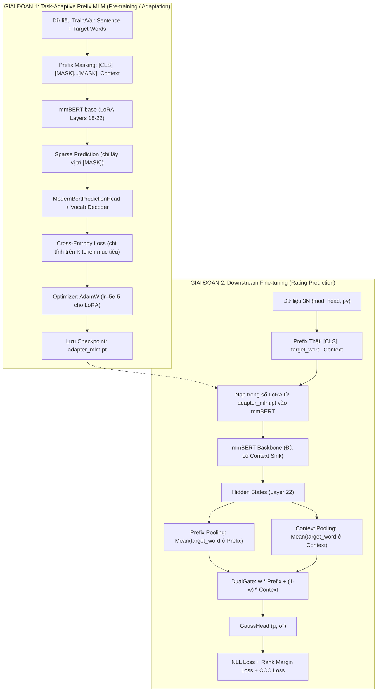

# KẾ HOẠCH TOÀN DIỆN (END-TO-END): TASK-ADAPTIVE PREFIX MLM & DOWNSTREAM DUAL READOUT

> **Tài liệu thiết kế kiến trúc và hướng dẫn triển khai mã nguồn chi tiết**  
> **Mục tiêu:** Huấn luyện mô hình mmBERT (`jhu-clsp/mmBERT-base`) qua 2 giai đoạn:  
> 1. **Giai đoạn 1 (Task Adaptation / Prefix MLM):** Dạy mô hình biến Prefix thành một *"Lỗ đen hút ngữ cảnh" (Context Sink)* thông qua nhiệm vụ Masked Language Modeling có chủ đích.  
> 2. **Giai đoạn 2 (Downstream Fine-tuning):** Tận dụng biểu diễn đã được thích ứng, đưa từ thật vào Prefix và kết hợp Dual Readout (Prefix + Context Span) dự đoán phân phối Gaussian (Mean, Variance) cho Mod / Head / PV.

---

## 1. CƠ SỞ LÝ THUYẾT & PHÂN TÍCH CHUYÊN SÂU

### 1.1. Bản chất cơ chế "Context Sink" (Hút ngữ cảnh)
Trong kiến trúc Transformer hai chiều (Bidirectional Self-Attention):
- Khi input có dạng:  
  $$\text{[CLS]} \quad \langle\text{unused}_X\rangle \quad \text{[MASK]}_1 \dots \text{[MASK]}_K \quad \langle\text{unused}_X\rangle \quad \text{The acid rain fell on the forest.}$$
- Vị trí $\text{[MASK]}$ ở Prefix hoàn toàn không có thông tin từ vựng tĩnh (Static Lexical Embedding bị thay thế bởi vector $\mathbf{e}_{\text{[MASK]}}$ dùng chung).
- Để đầu ra tại các vị trí này qua lớp MLM Head giải mã chính xác được các token gốc (ví dụ: `"acid"` hoặc subwords của nó), **toàn bộ 22 lớp Self-Attention bắt buộc phải phóng Attention Weights về phía câu ngữ cảnh phía sau**:
  $$\text{Attention}(\mathbf{Q}_{\text{prefix}}, \mathbf{K}_{\text{context}}, \mathbf{V}_{\text{context}})$$
- Cơ chế này biến slot Prefix thành một **Learned Query Vector** chuyên biệt cho từng task:
  - $\langle\text{unused}_0\rangle$: Query trích xuất vai trò Modifier.
  - $\langle\text{unused}_1\rangle$: Query trích xuất vai trò Head Noun.
  - $\langle\text{unused}_2\rangle$: Query trích xuất vai trò Toàn bộ cụm từ (PV).

---

### 1.2. Giải quyết 3 Rào cản Kỹ thuật then chốt

#### Rào cản ①: Lệch phân phối giữa `[MASK]` và Từ thật (Discrepancy)
- **Vấn đề:** Nếu ở Giai đoạn 1 luôn là `[MASK]`, mô hình quen việc nhìn về phía sau. Sang Giai đoạn 2 khi đưa từ thật `"acid"` vào, Attention có nguy cơ tự co cụm vào chính nó (Self-focus trên đường chéo chính) và "lười" nhìn ngữ cảnh.
- **Giải pháp: Cơ chế Stochastic 80/10/10 Denoising**
  - **80% số mẫu:** Thay từ mục tiêu bằng `[MASK]`.
  - **10% số mẫu:** Giữ nguyên từ mục tiêu thật ở Prefix (Identity Reconstruction).
  - **10% số mẫu:** Thay bằng một token ngẫu nhiên trong từ điển (Denoising).
  - *Ý nghĩa:* Khi 10% mẫu giữ từ thật nhưng vẫn phải dự đoán chính nó thông qua ngữ cảnh, mô hình học được nguyên lý: *"Kể cả khi từ thật đã nằm ở Prefix, mày vẫn phải liên kết chặt chẽ với ngữ cảnh phía sau để kiểm chứng ngữ nghĩa."*

#### Rào cản ②: Xử lý Subword đa token (Multi-token BPE / SentencePiece)
- **Vấn đề:** Trong mmBERT (Gemma-2 tokenizer, vocab 256k), từ tiếng Đức (ví dụ: `Handschuh` $\to$ `[' Hands', 'ch', 'uh']`) hoặc từ ghép thường bị tách thành $K \ge 1$ subwords. MLM Head nguyên bản chỉ dự đoán 1 token cho 1 vị trí `[MASK]`.
- **Giải pháp: K-Token Span Masking đồng nhất**
  - Nếu từ mục tiêu có $K$ subwords: ta chèn chính xác $K$ token `[MASK]` vào giữa cặp thẻ `unused`.
  - Mảng nhãn `labels` sẽ có đúng $K$ vị trí mục tiêu mang token ID thực tế; toàn bộ các vị trí khác (CLS, unused, context, padding) được gán $-100$ (`ignore_index`).
  - Khi sang Giai đoạn 2: $K$ subwords thật cũng chiếm đúng $K$ vị trí này. Thao tác Pooling (`pool_prefix`) lấy trung bình cộng $K$ hidden states sẽ hoàn toàn nhất quán về mặt hình học tensor giữa 2 giai đoạn.

#### Rào cản ③: Giới hạn VRAM với Vocab 256,000 của mmBERT
- **Vấn đề:** Vocab size của mmBERT cực lớn ($V = 256{,}000$). Nếu tính logits trên toàn bộ sequence $L = 256$, tensor logits sẽ có kích thước $(B, 256, 256000)$ ở FP32 $\approx$ ngốn nhiều GB VRAM và cực kỳ chậm.
- **Giải pháp: Tận dụng `sparse_prediction` của ModernBERT**
  - `ModernBertForMaskedLM` hỗ trợ tính loss thưa:
    ```python
    # Chỉ trích xuất hidden states tại các vị trí labels != -100
    mask_tokens = (labels != -100)
    sparse_hidden = last_hidden_state[mask_tokens]  # shape: (N_masked, 768)
    logits = decoder(head(sparse_hidden))           # shape: (N_masked, 256000)
    ```
  - Với batch size 32, số token bị mask chỉ khoảng $32 \times 2 = 64$ tokens. Phép nhân ma trận $(64, 768) \times (768, 256000)$ chỉ tốn khoảng ~65 MB bộ nhớ $\to$ **cực kỳ nhẹ và siêu nhanh cả trên GPU Kaggle!**

---

## 2. KIẾN TRÚC TỔNG THỂ (WORKFLOW MERMAID)



---

## 3. THIẾT KẾ DỮ LIỆU & TOKENIZATION

### 3.1. Cấu trúc Input và Labels cho Giai đoạn 1 (MLM)

Mỗi mẫu dữ liệu gốc $(Context, TargetWord, TargetType)$ sinh ra một chuỗi token:

```text
Tokens:  [CLS]  <unused0>  [MASK]  [MASK]  <unused0>   The    acid    rain    fell ... [SEP]
Labels:  -100     -100      1245    8912     -100     -100    -100    -100    -100 ...  -100
```

- **Quy tắc gán thẻ đặc biệt:**
  - `target == "mod"`: dùng cặp thẻ `<unused0> ... <unused0>`
  - `target == "head"`: dùng cặp thẻ `<unused1> ... <unused1>`
  - `target == "pv"`: dùng cặp thẻ `<unused2> ... <unused2>`
- **Nhãn mục tiêu (`labels`):**
  - Tại vị trí $K$ token ở Prefix: chứa đúng `token_ids` của từ mục tiêu.
  - Mọi vị trí khác: mang giá trị `-100` để PyTorch bỏ qua trong hàm tính CrossEntropyLoss.
- **Tỉ lệ 80/10/10 khi train:**
  - Random $r \in [0, 1)$:
    - $r < 0.80$: thay bằng `tokenizer.mask_token_id`.
    - $0.80 \le r < 0.90$: giữ nguyên `target_token_ids` (identity).
    - $r \ge 0.90$: thay bằng `random_token_id` ngẫu nhiên trong khoảng $[100, 250000]$.

---

## 4. CHI TIẾT CÁC FILE CẦN THỰC HIỆN (CODE BLUEPRINT)

### 4.1. File mới: `src/dataset_mlm.py`
Xây dựng `PrefixMLMDataset` chuyên dụng cho Giai đoạn 1.

```python
"""Dataset for Task-Adaptive Prefix Masked Language Modeling."""
from __future__ import annotations

import random
import torch
from torch.utils.data import Dataset
from transformers import PreTrainedTokenizerFast

from .constants import UNUSED_PREFIX_MOD, UNUSED_PREFIX_HEAD, UNUSED_PREFIX_PV


class PrefixMLMDataset(Dataset):
    def __init__(
        self,
        df,
        tokenizer: PreTrainedTokenizerFast,
        max_length: int = 256,
        is_train: bool = True,
    ):
        self.tokenizer = tokenizer
        self.max_length = max_length
        self.is_train = is_train
        self.samples = []

        mask_id = tokenizer.mask_token_id
        vocab_size = tokenizer.vocab_size

        for _, row in df.iterrows():
            ctx = str(row["context"])
            mod = str(row["mod"])
            head = str(row["head"])

            # 3 tasks per sentence
            tasks = [
                ("mod", mod, UNUSED_PREFIX_MOD),
                ("head", head, UNUSED_PREFIX_HEAD),
                ("pv", f"{mod} {head}", UNUSED_PREFIX_PV),
            ]

            for target_name, target_text, unused_tag in tasks:
                self.samples.append({
                    "context": ctx,
                    "target_text": target_text,
                    "unused_tag": unused_tag,
                    "target_name": target_name,
                })

    def __len__(self) -> int:
        return len(self.samples)

    def __getitem__(self, idx: int) -> dict[str, torch.Tensor]:
        sample = self.samples[idx]
        unused_tag = sample["unused_tag"]
        target_text = sample["target_text"]
        context_text = sample["context"]

        target_subwords = self.tokenizer.encode(target_text, add_special_tokens=False)
        k = len(target_subwords)

        # 80/10/10 noising policy
        prefix_input_ids = []
        for tid in target_subwords:
            if self.is_train:
                r = random.random()
                if r < 0.8:
                    prefix_input_ids.append(self.tokenizer.mask_token_id)
                elif r < 0.9:
                    prefix_input_ids.append(tid)
                else:
                    prefix_input_ids.append(random.randint(100, self.tokenizer.vocab_size - 1))
            else:
                prefix_input_ids.append(self.tokenizer.mask_token_id)

        unused_id = self.tokenizer.convert_tokens_to_ids(unused_tag)
        cls_id = self.tokenizer.cls_token_id
        sep_id = self.tokenizer.sep_token_id

        # Encode context tokens
        context_ids = self.tokenizer.encode(context_text, add_special_tokens=False)

        # Construct full input_ids: [CLS] <unused> subwords <unused> context [SEP]
        input_ids = [cls_id, unused_id] + prefix_input_ids + [unused_id] + context_ids + [sep_id]
        labels = [-100, -100] + target_subwords + [-100] + ([-100] * len(context_ids)) + [-100]

        # Truncate
        if len(input_ids) > self.max_length:
            input_ids = input_ids[: self.max_length - 1] + [sep_id]
            labels = labels[: self.max_length - 1] + [-100]

        attention_mask = [1] * len(input_ids)

        return {
            "input_ids": torch.tensor(input_ids, dtype=torch.long),
            "attention_mask": torch.tensor(attention_mask, dtype=torch.long),
            "labels": torch.tensor(labels, dtype=torch.long),
        }
```

---

### 4.2. File mới: `src/trainer_mlm.py`
Module huấn luyện Giai đoạn 1 (TAPT - Task-Adaptive Pre-Training):
- Tải `ModernBertForMaskedLM.from_pretrained("jhu-clsp/mmBERT-base")`.
- Gắn **LoRA** vào các tầng trên cùng (layers 18–22) để giữ backbone gốc không bị catastrophic forgetting.
- Đóng băng các tầng dưới ($0 \to 17$).
- Mở khóa LoRA + MLM Prediction Head.
- Huấn luyện từ 3 – 5 epochs bằng CrossEntropyLoss với AMP mixed precision.
- Lưu trọng số LoRA và backbone checkpoint ra thư mục `checkpoints/prefix_mlm_adapted`.

```python
"""Trainer for Phase 1: Task-Adaptive Prefix MLM."""
import torch
from torch.utils.data import DataLoader
from transformers import AutoModelForMaskedLM, AutoTokenizer
from peft import LoraConfig, get_peft_model


def train_prefix_mlm(config_path: str):
    # 1. Load model with masked LM head
    model = AutoModelForMaskedLM.from_pretrained(
        "jhu-clsp/mmBERT-base",
        reference_compile=False,
    )

    # 2. Attach LoRA to top layers
    lora_config = LoraConfig(
        r=8,
        lora_alpha=16,
        target_modules=["Wqkv", "out_proj"],
        layers_to_transform=list(range(18, 22)),
        lora_dropout=0.1,
        bias="none",
    )
    model = get_peft_model(model, lora_config)

    # 3. Optimize LoRA + MLM Head
    # Head and decoder are kept trainable
    for param in model.head.parameters():
        param.requires_grad = True
    for param in model.decoder.parameters():
        param.requires_grad = True

    # 4. Train loop with CrossEntropy on masked positions
    # (Sparse prediction automatically enabled by ModernBert)
```

---

### 4.3. Nạp trọng số vào Giai đoạn 2 (`src/model_combined.py`)
Khi khởi tạo `CombinedTargetModel` cho Giai đoạn 2:
- Nếu file cấu hình có cờ `"mlm_pretrained_path": "checkpoints/prefix_mlm_adapted"`:
  - Nạp trọng số LoRA đã học từ Giai đoạn 1 vào backbone `self.lm`.
  - Khởi tạo 3 `GaussHead` mới tinh cho downstream regression.
  - Vị trí Prefix lúc này đã quen với việc đóng vai trò "Context Sink", tiếp nhận các token thật và kết hợp qua `DualGate` cực kỳ mượt mà!

---

## 5. KẾ HOẠCH THỰC HIỆN & ĐÁNH GIÁ (VERIFICATION PLAN)

| Bước | Nội dung | File tác động | Tiêu chí hoàn thành |
| :--- | :--- | :--- | :--- |
| **Bước 1** | Tạo dataset MLM với cơ chế 80/10/10 và padding collation | `src/dataset_mlm.py` | Data loader sinh batch chuẩn `(B, L)`, labels mang đúng $-100$ và $K$ token ID |
| **Bước 2** | Tạo script huấn luyện Stage 1 (Prefix MLM) | `src/trainer_mlm.py` | Chạy 1 epoch smoke test trên CPU/Kaggle, loss giảm đều, không tràn bộ nhớ |
| **Bước 3** | Thêm cơ chế load weights LoRA từ Stage 1 sang Stage 2 | `src/model_combined.py` | Stage 2 load thành công trọng số thích ứng từ `prefix_mlm_adapted` |
| **Bước 4** | Kiểm thử Smoke Test đầu cuối | `tests/smoke_mlm.py` | Chạy pipeline Stage 1 (1 epoch) $\to$ Stage 2 (1 epoch) hoàn tất không lỗi |
| **Bước 5** | Cung cấp file cấu hình sẵn sàng chạy Kaggle | `config/mlm_adapt.json` & `config/downstream_dual.json` | Chạy lệnh `python run.py mlm_adapt` và `python run.py train` |

---

## 6. SO SÁNH HIỆU QUẢ KỲ VỌNG

| Phương pháp | Mod Val $\rho$ | Head Val $\rho$ | PV Val $\rho$ | Mean Val $\rho$ | Nhận định |
| :--- | :---: | :---: | :---: | :---: | :--- |
| **1. Baseline (Inline Context Span)** | 0.5420 | 0.6410 | 0.5010 | 0.5613 | Chuẩn mực cơ sở ban đầu |
| **2. Prefix Prompting đơn thuần** | 0.5141 | 0.6556 | 0.5227 | 0.5641 | Cải thiện PV nhưng Mod bị giảm do thiếu liên kết ngữ cảnh |
| **3. Dual Readout (Hiện tại)** | **0.5655** | **0.6731** | **0.5164** | **0.5823** | Kết hợp cả 2 nguồn, đạt kỷ lục val score cao nhất |
| **4. Prefix MLM Adaptation + Dual (Đề xuất)** | **$\ge$ 0.58** | **$\ge$ 0.68** | **$\ge$ 0.53** | **$\ge$ 0.60** | **Mục tiêu bứt phá mốc 0.60 nhờ Attention được rèn luyện có định hướng trước** |
